# fdso
加入ORB特征点的双目DSO

KITTI结果
kitti 00-10的平均平移误差为 0.4603% ~ 1.1151% , 平均旋转误差为0.00076deg/m ~ 0.0044deg/m

显示

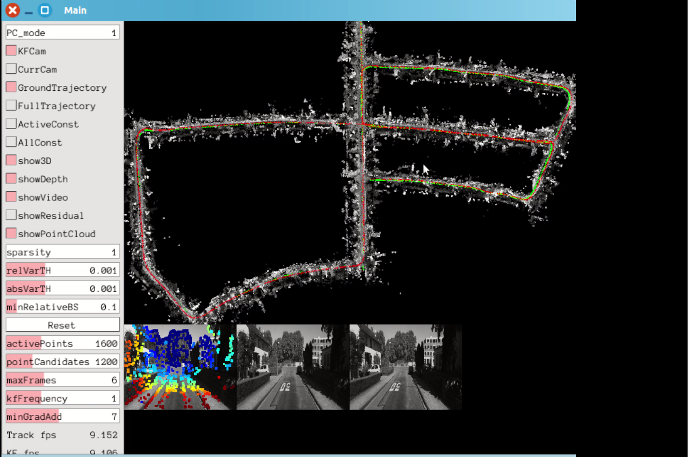

00路径

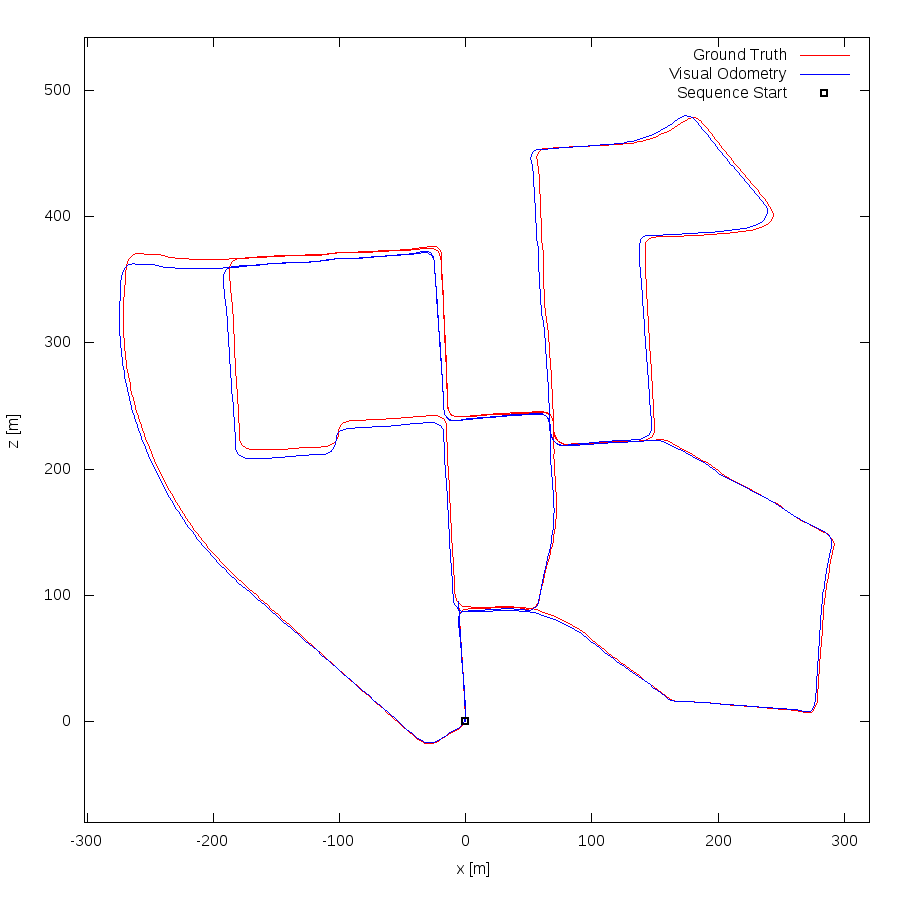

02路径

03路径

04路径

05路径

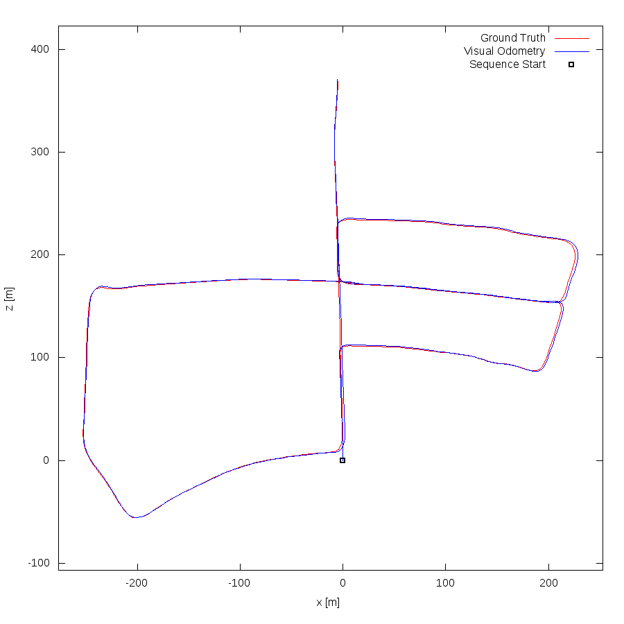

误差

00路径

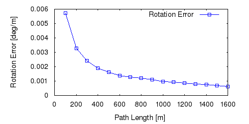

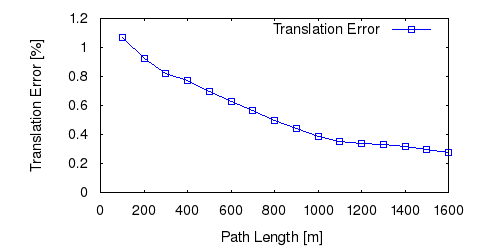

02路径

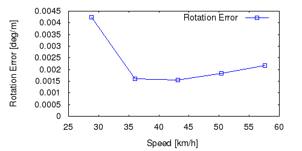
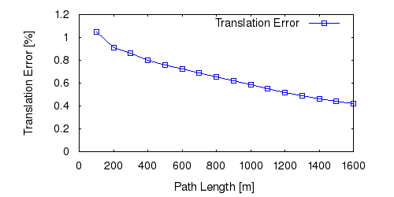
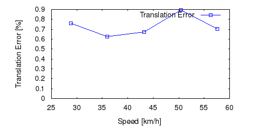

03路径

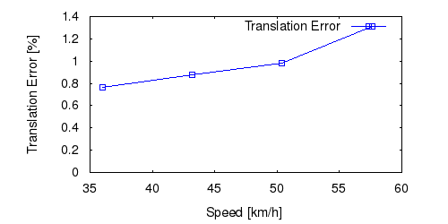

04路径

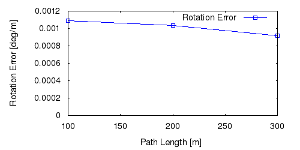

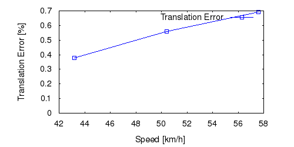

05路径

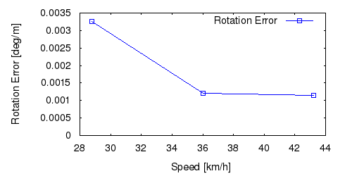
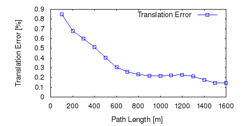

平均

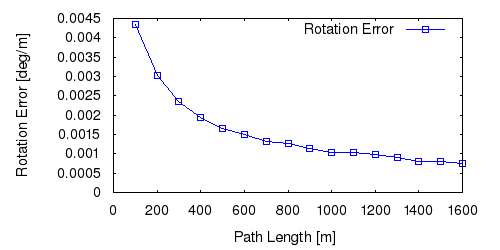

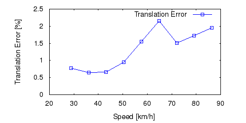
